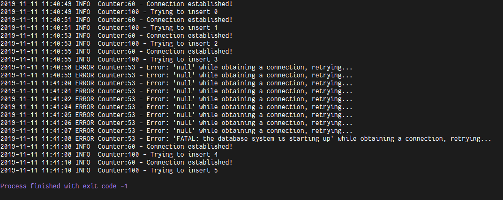
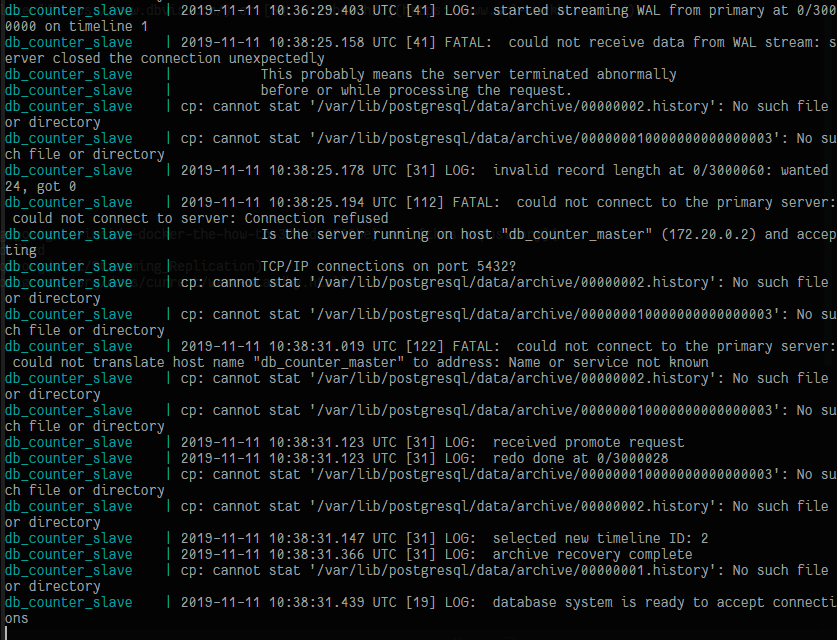
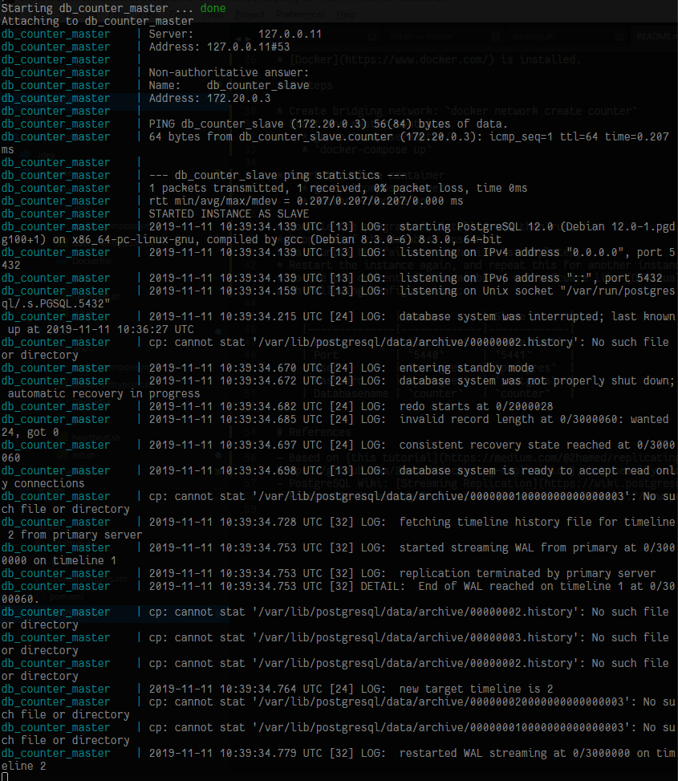

# counterpostgres

Small programm to test the [streaming replication](https://wiki.postgresql.org/wiki/Streaming_Replication) mechanism and failover mechanism between 2 [PostgreSQL](https://www.postgresql.org/) database instances.
Both instances are deployed locally using [Docker container](https://hub.docker.com/_/postgres).

## What?

A small java programm that tries to write an integer to the PostgreSQL database every 2s.
There are 2 database instances, master and slave, the programm will then try to obtain connection to the master instance.
If there is a problem occured while connecting / while writing / the master instance is shut down, the program will rather retry to connect again until the slave instance take the role as master (until the failover mechanism is completed) than just throw an exception.
There is no data loss when writing to the database, because the counter will not skip / throw an exception / crash when the master instance is down, but rather wait until the same master is up again or until the slave take the role as the new master.

The 2 PostgreSQL instances' configuration files are basically almost analogue / almost the same to each other, with the only differences are the IP address / domain name of the other server specified in both configuration files.
Thus, the order on how the database instances are started does not matter, as the first instance will take the role as master, and the second instance will notice that there is a instance up and running already, and then will start itself as slave.

The 2 PostgreSQL instances will ping each other in the background, checking if the other one is still up or down.
If the slave notice that the current master is down, than it will promote itself as the new master.
See `compose/master/heartbeat.sh` or `compose/slave/heartbeat.sh`

PostgreSQL version used: version 12, see `compose/master/Dockerfile` or `compose/slave/Dockerfile`

## Why?

To test the redundancy aspect of PostgreSQL, the failover, backup, replication configuration should only be done in PostgreSQL instances, not inside the application (e.g. here in counter).
This means everything should be transparent to the application, the application should just know the address of both database instance and configured to only be allowed to write to master instance.

See PostgreSQL [jdbc documentation](https://jdbc.postgresql.org/documentation/head/connect.html) and `src/main/resources/db_info.properties`

## How

### Requirements

* [Docker](https://www.docker.com/) is installed.

### Steps

* Create bridging network: `docker network create counter`
* Start the master container
	* go to `compose/master/`
	* `docker-compose up`

* Start the slave container
	* go to `compose/slave/`
	* `docker-compose up`

* Compile the programm in IntelliJ and then run.
* Stop one of the database instance,
* Wait until the failover mechanism is completed,
* Restart the instance again, and repeat this for another instance. See [screenshots](#screenshots) below for example output.
* To see the content of the database, use software like [DBVisualizer](https://www.dbvis.com/) or [SQL Workbench/J](https://www.sql-workbench.eu/) with following configurations:

	|              | Master      | Slave       |
	|--------------|-------------|-------------|
	| Host         | `localhost` | `localhost` |
	| Port         | `5440`      | `5441`      |
	| User         | `postgres`  | `postgres`  |
	| Password     | `postgres`  | `postgres`  |
	| Databasename | `counter`   | `counter`   |

### Cleanup

* To remove all containers, images and volumes used in this repo, run: `compose/cleanup.sh`

## Screenshots

Output from counter while waiting for the failover process to be completed:

Slave instance notices that the master is down, then takeover as the new master:

The old master instance is restarted, notices that there is already existing new master, then starts itself as slave:

## References

- Based on [this tutorial](https://medium.com/@2hamed/replicating-postgres-inside-docker-the-how-to-3244dc2305be) and [this repository](https://github.com/2hamed/docker-pg-replication), but heavily modified
- PostgreSQL Wiki: [Streaming Replication](https://wiki.postgresql.org/wiki/Streaming_Replication)
- PostgreSQL Streaming Replication [Documentation](https://www.postgresql.org/docs/current/warm-standby.html)
